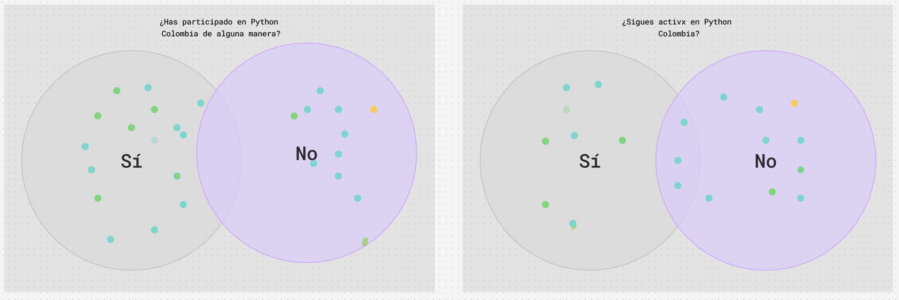
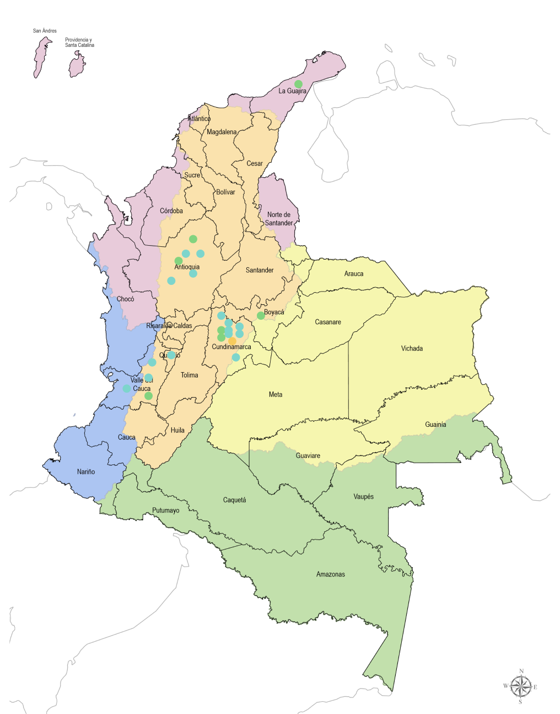
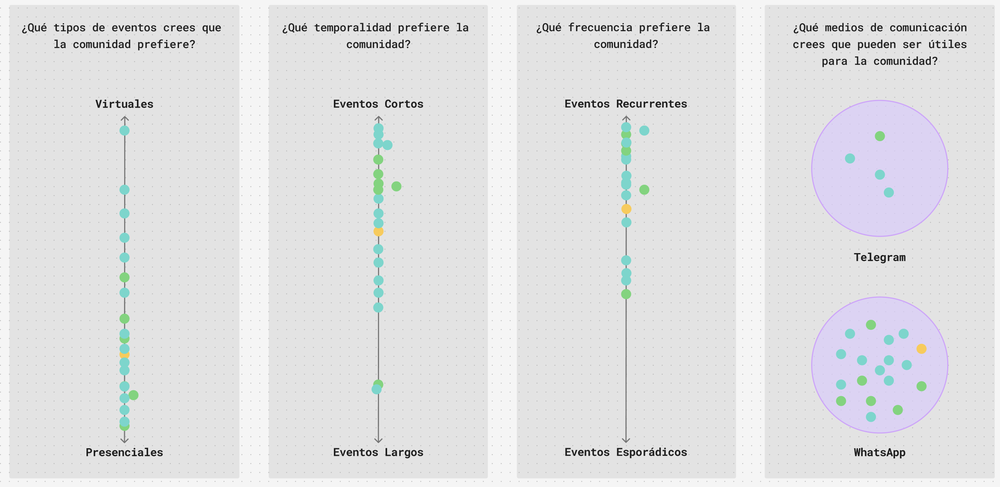
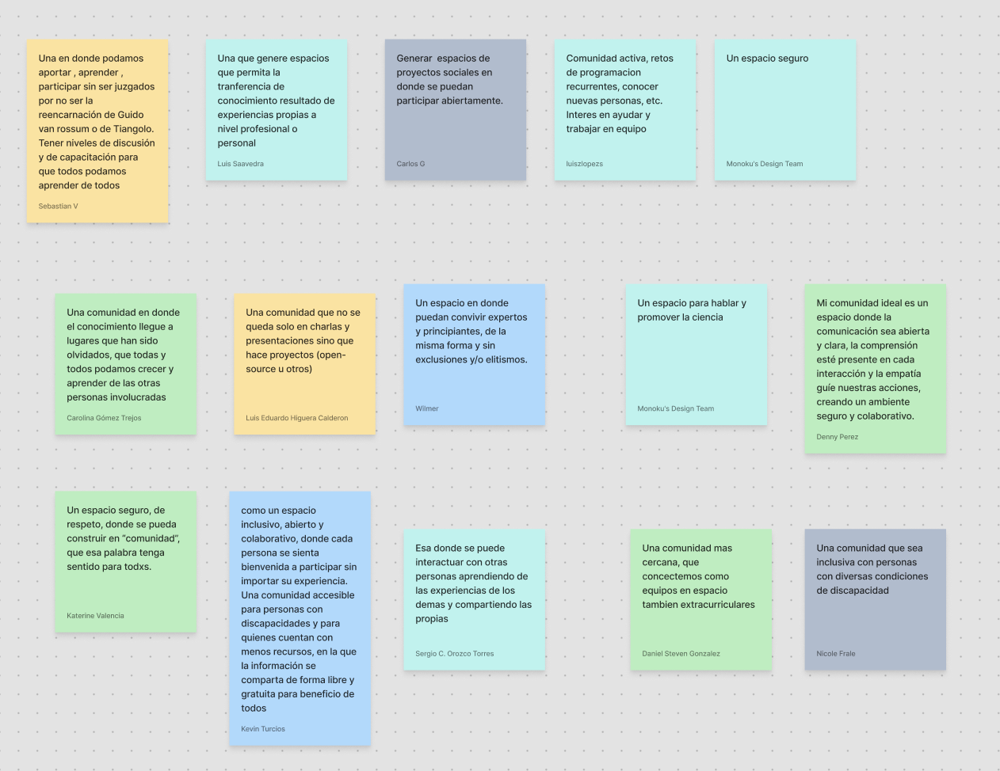
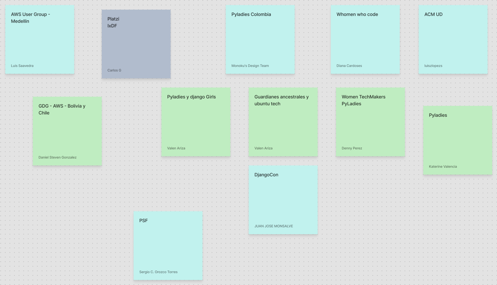
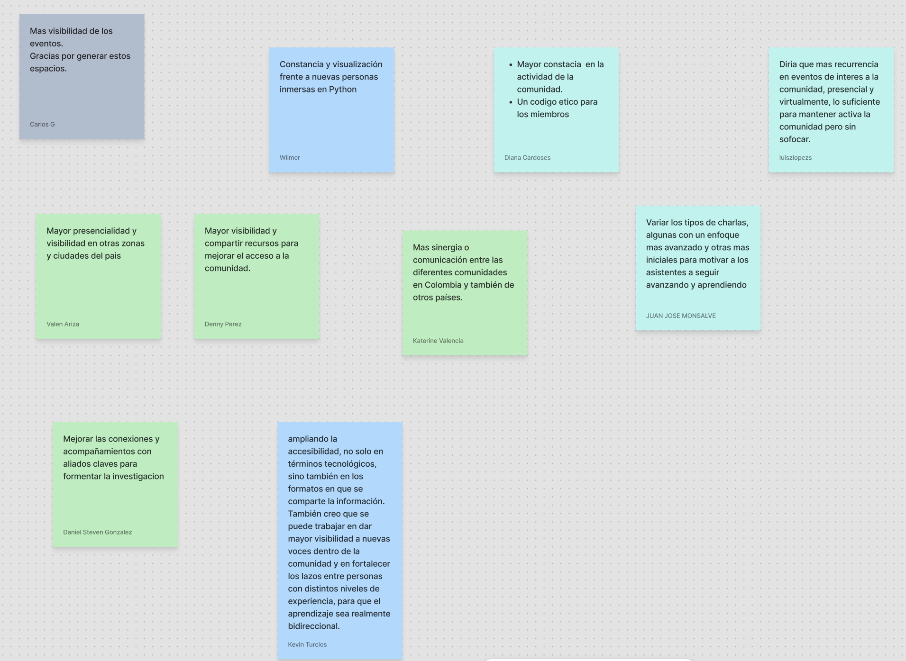
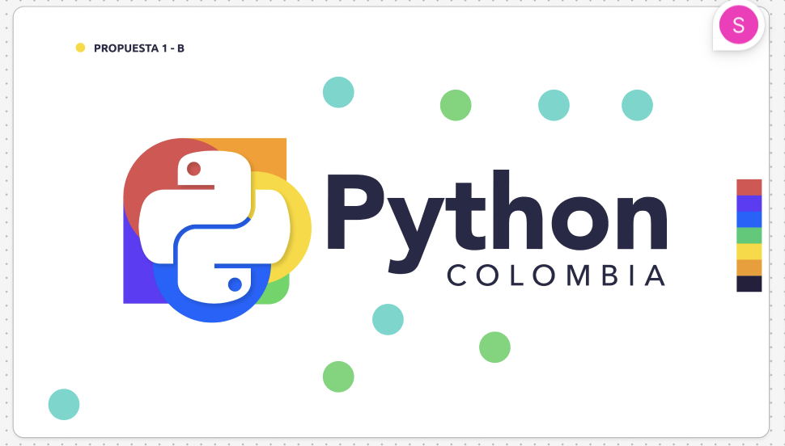

# Minuta Reunión 25 de septiembre de 2025

Este documento recoge las ideas, aportes y compromisos que surgieron durante la reunión virtual del 25 de septiembre de 2025, en la que compartimos propuestas para impulsar el renacer de la comunidad Python Colombia.

El encuentro se dividió en seis partes y contó con el apoyo de la plataforma Figma, donde ya se tenía material estructurado para facilitar un diálogo asertivo y participativo.

---

## Parte 0: Presentación

Se realizó la presentación de las personas que actualmente lideran los procesos de reactivación de la comunidad: **Karolina Ladino-Puerto**, **Carolina Gómez Trejos** y **Nicole Franco-León**.  
Ellas compartieron el propósito del encuentro y la importancia de construir colectivamente los próximos pasos de Python Colombia.

---

## Parte 1: ¿Quiénes están?

La comunidad Python Colombia ha sido, desde sus inicios, un espacio de encuentro, colaboración y aprendizaje compartido.  
Por ello, consideramos fundamental conocer quiénes hacen parte de esta comunidad y comprender cómo ha sido el flujo de participación a lo largo del tiempo.  

Para ello, se implementaron unos **diagramas de Venn** que permiten visualizar la evolución de dicha participación y los puntos de intersección entre diferentes grupos.

---

## Parte 2: ¿Dónde estamos?

Conocer la ubicación de las personas que integran la comunidad es esencial para identificar los territorios donde debemos fortalecer nuestra presencia y aquellos donde la participación aún es limitada.  
La representatividad territorial refleja nuestra diversidad y nos orienta hacia una comunidad más equitativa y descentralizada.  

A través de un **mapa de Colombia con división departamental**, se evidenció que las grandes urbes siguen liderando la participación; sin embargo, las zonas más alejadas presentan una baja representatividad, lo que marca un reto y una oportunidad de expansión.

---

## Parte 3: ¿Cómo queremos volver?

Con el propósito de fortalecernos nuevamente como comunidad, buscamos reactivarnos a través de redes de apoyo sólidas y descentralizadas.  
Para ello, se exploraron las **preferencias de participación** de la comunidad en cuanto a presencialidad, duración y frecuencia de los eventos, así como los medios de comunicación más efectivos.

Estas preguntas se diseñaron con el objetivo de garantizar la renovación y sostenibilidad de los próximos espacios y encuentros.

**Principales hallazgos:**  
La comunidad desea fortalecerse en la **presencialidad** y la **recurrencia** de los eventos, priorizando formatos cortos que se adapten mejor a la disponibilidad de tiempo de las personas.  
Asimismo, **WhatsApp** se consolida como el canal preferido para la difusión de información y coordinación de actividades.

---

## Parte 4: ¿Cómo proyectamos nuestra comunidad?

Esta fue una de las fases más extensas, ya que permitió escuchar las voces de quienes participaron sobre su ideal de comunidad, las oportunidades de mejora y los referentes que inspiran su labor.

Esta sección se abordó a partir de tres preguntas clave:

### 1. ¿Cómo te imaginas tu comunidad ideal?

Algunos de los aspectos más mencionados fueron:

- Inclusión de lugares y personas usualmente olvidadas.  
- Espacios que vayan más allá de charlas y presentaciones.  
- Intercambio entre personas con distintos niveles de experiencia.  
- Comunidad activa y diversa.  
- Entorno seguro, inclusivo y empático.  
- Conexión humana más allá de los temas técnicos.

Durante el espacio de conversación se compartieron ideas valiosas, entre ellas:

- La comunidad debe ser un espacio de **construcción colectiva**, donde las personas nuevas se sientan bienvenidas y reconocidas.  
- Es necesario romper con la percepción de **elitismo**, promoviendo un conocimiento abierto y accesible.  
- Un liderazgo **transparente y colaborativo** ayudará a reducir fragmentaciones y fortalecer la confianza.

---

### 2. ¿Qué comunidades del mundo admiras?

Este espacio permitió reconocer referentes internacionales e identificar buenas prácticas de las que podemos inspirarnos para fortalecer nuestra comunidad.

Algunas de las comunidades más mencionadas fueron:

- PyLadies  
- AWS  
- Django Girls  
- Women Who Code  

Entre muchas otras que destacan por su impacto, inclusión y trabajo colaborativo.

---

### 3. ¿Qué oportunidades de mejora ves?

Esta pregunta permitió identificar las debilidades actuales de la comunidad y definir los primeros pasos para superarlas.

De las aportaciones surgieron tres ejes principales:

- **Visibilidad:** Ampliar la presencia y comunicación de las actividades de la comunidad.  
- **Frecuencia:** Mantener un ritmo constante de eventos y encuentros para fomentar la continuidad.  
- **Sinergia entre comunidades:** Colaborar con otros grupos y movimientos afines, potenciando el aprendizaje y el alcance de nuestras acciones.

---

## Parte 5: Nos renovamos en todos los aspectos

Con el objetivo de renovarnos integralmente, el **logo que ha representado a Python Colombia** durante varios años fue sometido a un proceso de rediseño.  
Después de evaluar nueve propuestas, se seleccionó la versión ganadora, la cual ya hace parte de nuestra imagen actual.

---

## Parte 6: Queremos seguir en contacto

Queremos mantener el vínculo con todas las personas que participaron, ya que nuestros planes a futuro son ambiciosos y requieren del apoyo de toda la comunidad.  
Por ello, se creó un **directorio de contacto**, que nos permitirá coordinar reuniones, iniciativas y nuevas propuestas.

👉 [Formulario de contacto](https://forms.gle/njPBFrW9DGGjNWZw8)

---

## Despedida

No queda más que agradecer la participación, el entusiasmo y el compromiso de todas las personas que hicieron parte de este encuentro.  
Continuaremos documentando cada paso que damos en este proceso de reactivación y fortalecimiento de la comunidad **Python Colombia**.

---
